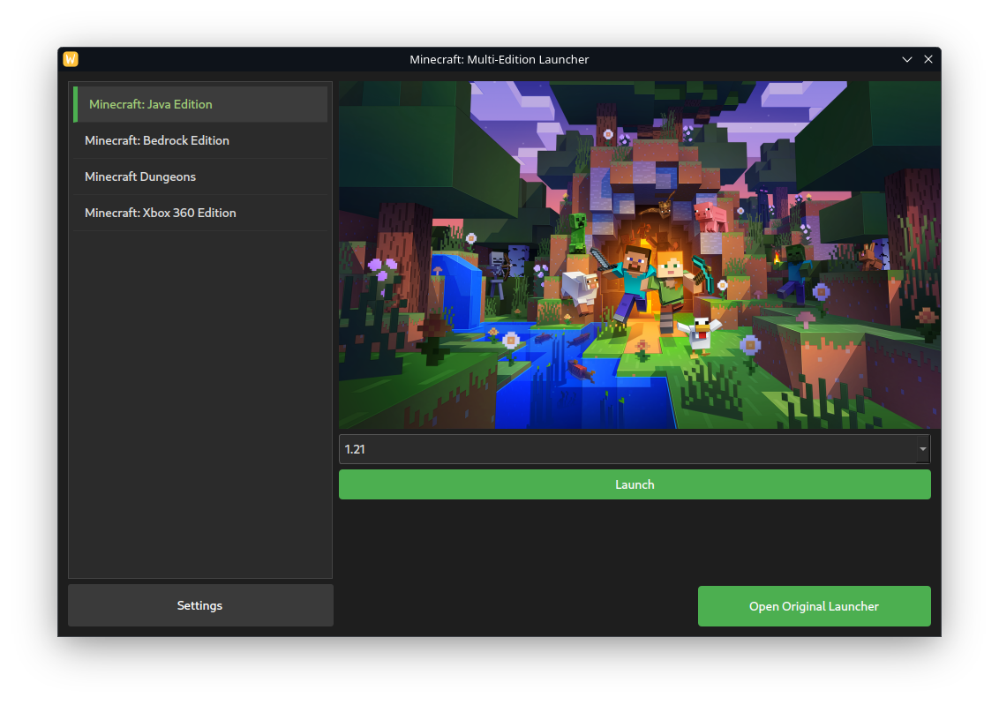
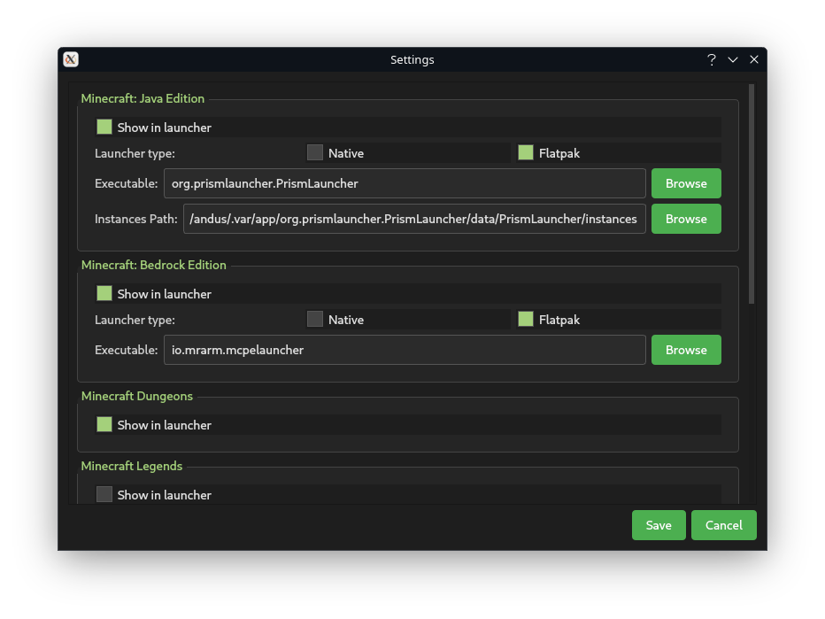

# Minecraft: Multi-Edition Launcher

Minecraft: Multi-Edition Launcher (MCMEL in short) is a launcher for Linux that allows you to launch multiple editions
of Minecraft in one launcher.

> [!IMPORTANT]  
> This project doesn't support piracy! Please buy the games you're using with this launcher.

## Why it exists?

It started because the official Minecraft launcher doesn't allow users to run Bedrock Edition, Dungeons or Legends on
Linux (even though Dungeons and Legends are available on Steam).

This launcher also adds other versions such as Story Mode (Season 1 and 2) and Xbox 360 Edition.

## How do I hide/show editions?

In the **Settings** menu, each edition has a **"Show in launcher"** toggle.
Simply enable or disable it based on which editions you want to appear in the launcher.

## How to configure the editions?

In **Settings**, you will find sections for each edition. Every edition has different things to setup:

> [!NOTE]  
> If you have trouble setting something up, feel free to join my
> [Discord Server](https://discord.gg/xjYFtN3pCw) and ask for help!

### Minecraft: Java Edition:

#### Requirements:

- MultiMC Launcher (or it's fork like Prism Launcher, PolyMC, Fjord Launcher)
    - Native & Flatpak versions are supported
- A Minecraft Account (obviously)

#### Setup:

- Launcher Executable
    - Examples:
        - Prism Launcher:
            - **Flatpak:** `org.prismlauncher.PrismLauncher`
            - **Native:** `prismlauncher`
- Instances Directory
    - Examples:
        - Prism Launcher:
            - **Flatpak:** `/home/{user}/.var/app/org.prismlauncher.PrismLauncher/data/PrismLauncher/instances`
            - **Native:** `/home/{user}/.local/share/PrismLauncher/instances`

### Minecraft: Bedrock Edition:

#### Requirements:

- [Minecraft Bedrock Launcher](https://minecraft-linux.github.io/)
    - Native & Flatpak versions are supported
- Minecraft **bought on Google Play Store**

#### Setup:

- Launcher Executable
    - **Flatpak:** `io.mrarm.mcpelauncher`
    - **Native:** `mcpelauncher-ui-qt`

### Minecraft Dungeons / Legends

#### Requirements:

- Minecraft Dungeons / Legends **owned on Steam**
- Steam

#### Setup:

Doesn't require any setup outside toggling "Show" in Settings

### Minecraft: Story Mode (Season 1 and 2):

> [!IMPORTANT]  
> Those editions aren't currently supported and are not shown in settings

#### Requirements:

- Minecraft: Story Mode Season 1 / 2 **bought on one of those platforms:**
    - Steam
    - GOG (installed using Lutris)

#### Setup:

- (When using GOG version) the games' slugs should be named
  `minecraft-story-mode` and `minecraft-story-mode-season-2` respectively in Lutris.
- Doesn't require any setup outside toggling "Show" in Settings.

### Minecraft: Xbox 360 Edition:

#### Requirements:

- Xenia:
    - I had problems with Linux version, so the launcher expects the Windows version.
- Steam
    - There will later be an option to change the proton path, so Steam wouldn't be needed in the future.
    - If you really don't want to install Steam, symbolic link of your Proton installation
      to `/home/{user}/.steam/steam/steamapps/common/Proton - Experimental/` **should** work (but I haven't tested it)
- Proton Experimental
    - Installed in the default location: `/home/{user}/.steam/steam/steamapps/common/Proton - Experimental/`

#### Setup:

- Xenia Executable
    - Example: `/home/{user}/x360/xenia_canary.exe`
- Minecraft: Xbox 360 Edition
    - Example: `/home/{user}/x360/content/49AAD81B9FCDA45E4A03D71BFCB353F8FADB236C58`

## Credits:

### Direct help:

- **[Andus](https://andus.dev/)** - Lead Developer
- **[Contributors]()** (maybe someday)

### Indirect help:

- **[MultiMC](https://multimc.org/) and it's forks** - Java Edition
- **[MCPELauncher](https://minecraft-linux.github.io)** - Bedrock Edition
- **[Xenia](https://xenia.jp/)** - Xbox 360 Edition

### Images:
- **[Minecraft Wallpapers](https://www.minecraft.net/en-us/collectibles)** - Minecraft Java / Bedrock / Dungeons / Legends
- **Steam** - Minecraft: Story Mode Seasons 1/2
- **Xbox 360 Loading Screen** - Minecraft: Xbox 360 Edition
- **Screenshot from [classic.minecraft.net](classic.minecraft.net)** - Minecraft Classic