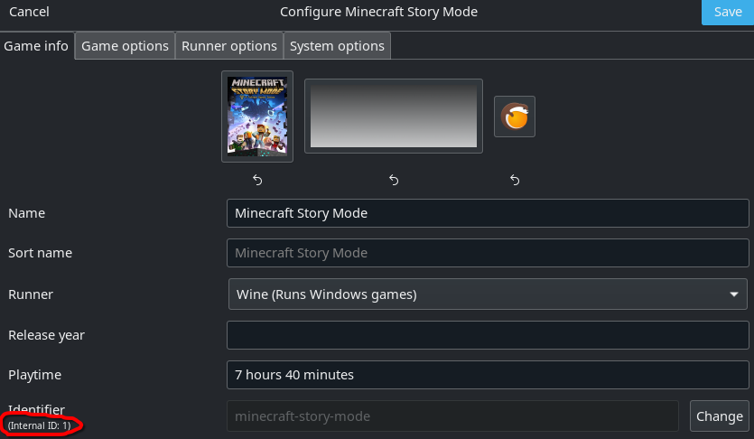

# Minecraft: Multi-Edition Launcher

Minecraft: Multi-Edition Launcher (MCMEL in short) is a launcher for Linux that allows you to launch multiple editions
of Minecraft in one launcher.

**[Website](https://mcmel.andus.dev)**

> [!IMPORTANT]  
> This project doesn't support piracy! Please buy the games you're using with this launcher.

## FAQ:
- **[Why it exists?](#why-it-exists)**
- **[How do I hide/show editions?](#how-do-i-hideshow-editions)**
- **[How to configure the editions?](#how-to-configure-the-editions)**
  - [Minecraft: Java Edition](#minecraft-java-edition)
    - _[Splitscreen](#how-to-play-in-splitscreen-v021)_
  - [Minecraft: Bedrock Edition](#minecraft-bedrock-edition)
  - [Minecraft Dungeons/Legends](#minecraft-dungeons--legends)
  - [Minecraft Story Mode (Season 1 & 2)](#minecraft-story-mode-season-1-and-2-v020)
  - [Minecraft: Xbox 360 Edition](#minecraft-xbox-360-edition)
  - [Minecraft Classic](#minecraft-classic)
- **[Credits](#how-to-configure-the-editions)**

## Why it exists?

It started because the official Minecraft launcher doesn't allow users to run Bedrock Edition, Dungeons or Legends on
Linux (even though Dungeons and Legends are available on Steam).

This launcher also adds other versions such as Story Mode (Season 1 and 2) and Xbox 360 Edition.

## How do I hide/show editions?

In the **Settings** menu, each edition has a **"Show in launcher"** toggle.
Simply enable or disable it based on which editions you want to appear in the launcher.

## How to configure the editions?

In **Settings**, you will find sections for each edition. Every edition has different things to setup:

> [!NOTE]  
> If you have trouble setting something up, feel free to join my
> [Discord Server](https://discord.gg/xjYFtN3pCw) and ask for help!

### Minecraft: Java Edition:

#### Requirements:

- MultiMC Launcher (or it's fork like Prism Launcher, PolyMC, Fjord Launcher)
    - Native & Flatpak versions are supported
- A Minecraft Account (obviously)

#### Setup:

- Launcher Executable
    - Examples:
        - Prism Launcher:
            - **Flatpak:** `org.prismlauncher.PrismLauncher`
            - **Native:** `prismlauncher`
- Instances Directory
    - Examples:
        - Prism Launcher:
            - **Flatpak:** `/home/{user}/.var/app/org.prismlauncher.PrismLauncher/data/PrismLauncher/instances`
            - **Native:** `/home/{user}/.local/share/PrismLauncher/instances`

#### How to play in splitscreen (v0.2.1+):

1. Create a new instance in MultiMC:
    - Pick **Fabric Loader** for **Minecraft 1.20.1 or higher**
2. Install those mods:
    - [Fabric API](https://modrinth.com/mod/fabric-api)
    - [Splitscreen Support](https://modrinth.com/mod/splitscreen)
    - [Midnight Controls](https://modrinth.com/mod/midnightcontrols)
3. Launch and configure the instance:
    - Press `F11` to position the window
    - In **Midnight Controls** settings set `Unfocused Input` and `Virtual Mouse`
    - When in-game press `F3+P` to disable pause on lost focus
    - Stop the instance
4. Duplicate the instance:
    - **Right click** the instance -> **Copy Instance**
    - In the dialog, **make sure** that **"Copy Settings"** and **"Copy Mods"** (or similar) are **checked**
    - **Add ` 2`** to the name of the **duplicate/second instance**
        - For example: if the first instance was named `Splitscreen 1.21` then this one needs to be named `Splitscreen 1.21 2`
5. Launch the **second instance**:
    - Start the **second instance**
    - Press `F11`  to move it to the right side of the screen.
    - Stop the instance
6. Add **another Minecraft account** _(if needed)_:
    - In MultiMC: `Settings -> Accounts`
    - Add the second account:
        - Microsoft if you're planning playing on multiplayer servers
        - Otherwise offline account will be enough
7. Run the game with MCMEL:
    - Launch **MCMEL** and select your **first** splitscreen instance.
    - Make sure **splitscreen mode is enabled** and you **picked a different account** for the **second instance**.
8. Set up controllers and play:
    - In **Midnight Controls** settings, assign each game window to a different controller.
    - Enjoy splitscreen Minecraft on one PC!

### Minecraft: Bedrock Edition:

#### Requirements:

- [Minecraft Bedrock Launcher](https://minecraft-linux.github.io/)
    - Native & Flatpak versions are supported
- Minecraft **bought on Google Play Store**

#### Setup:

- Launcher Executable
    - **Flatpak:** `io.mrarm.mcpelauncher`
    - **Native:** `mcpelauncher-ui-qt`

### Minecraft Dungeons / Legends

#### Requirements:

- Minecraft Dungeons / Legends **owned on Steam**
- Steam

#### Setup:

Doesn't require any setup outside toggling "Show" in Settings

### Minecraft: Story Mode (Season 1 and 2) (v0.2.0+):

#### Requirements:

- Minecraft: Story Mode Season 1 / 2 **bought on one of those platforms:**
    - Steam
    - GOG (installed using Lutris)

#### Setup:

- Doesn't require any setup outside toggling "Show" in Settings.
- (When using GOG version) Executable should just be a game id from lutris

### Minecraft: Xbox 360 Edition:

#### Requirements:

- Xenia:
    - I had problems with Linux version, so the launcher expects the Windows version.
- Steam
    - There will later be an option to change the proton path, so Steam wouldn't be needed in the future.
    - If you really don't want to install Steam, symbolic link of your Proton installation
      to `/home/{user}/.steam/steam/steamapps/common/Proton - Experimental/` **should** work (but I haven't tested it)
- Proton Experimental
    - Installed in the default location: `/home/{user}/.steam/steam/steamapps/common/Proton - Experimental/`

#### Setup:

- Xenia Executable
    - Example: `/home/{user}/x360/xenia_canary.exe`
- Minecraft: Xbox 360 Edition
    - Example: `/home/{user}/x360/content/49AAD81B9FCDA45E4A03D71BFCB353F8FADB236C58`

### Minecraft Classic:

#### Requirements:

- Internet Connection
- Web Browser

#### Setup:

- Doesn't require any setup outside toggling "Show" in Settings.

## Credits:

### Direct help:

- **[Andus](https://andus.dev/)** - Lead Developer
- **[Contributors]()** (maybe someday)

### Indirect help:

- **[MultiMC](https://multimc.org/) and it's forks** - Java Edition
- **[MCPELauncher](https://minecraft-linux.github.io)** - Bedrock Edition
- **[Xenia](https://xenia.jp/)** - Xbox 360 Edition

### Images:
- **[Minecraft Wallpapers](https://www.minecraft.net/en-us/collectibles)** - Minecraft Java / Bedrock / Dungeons / Legends
- **Steam** - Minecraft: Story Mode Seasons 1/2
- **Xbox 360 Loading Screen** - Minecraft: Xbox 360 Edition
- **Screenshot from [classic.minecraft.net](classic.minecraft.net)** - Minecraft Classic